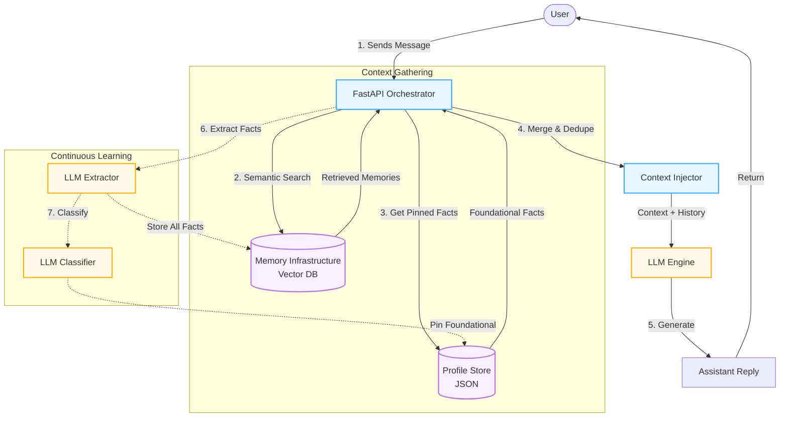

# Memoria Architecture Flow

Here are two visualizations of the Memoria system. The first is a high-level component flowchart, and the second is a detailed sequence diagram showing the step-by-step lifecycle of a single user request.

## High-Level Component Flowchart

This flowchart illustrates how the different components of Memoria interact during a chat turn.

---

## Detailed Sequence Diagram

This sequence diagram breaks down the precise 5-step RAG loop executed by the Orchestrator for every incoming message.

```mermaid
sequenceDiagram
    autonumber
    actor User
    participant FastAPI as Orchestrator
    participant MemoriaDB as Memory Infrastructure
    participant ProfileStore as Profile Store
    participant LLM as LLM Engine

    User->>FastAPI: POST /chat (session_id, message)
    
    rect rgb(30, 30, 30)
    Note right of FastAPI: Step 1: Retrieve
    FastAPI->>MemoriaDB: Search memories (boost session_id)
    MemoriaDB-->>FastAPI: Return ranked semantic memories
    end

    rect rgb(40, 40, 40)
    Note right of FastAPI: Step 2: Pinned Facts
    FastAPI->>ProfileStore: Get pinned facts for profile
    ProfileStore-->>FastAPI: Return deterministic facts
    end

    rect rgb(30, 30, 30)
    Note right of FastAPI: Step 3: Inject Context
    Note over FastAPI: Merge and deduplicate<br/>pinned facts + retrieved memories
    end

    rect rgb(40, 40, 40)
    Note right of FastAPI: Step 4: Respond
    FastAPI->>LLM: Generate reply (Context + History + Message)
    LLM-->>FastAPI: Generated Assistant Reply
    FastAPI-->>User: Return Reply to Client
    end

    rect rgb(30, 30, 30)
    Note right of FastAPI: Step 5: Write-Back & Auto-Pin (Background)
    FastAPI->>LLM: Extract new facts from conversation
    LLM-->>FastAPI: List of facts
    
    par Store All
        FastAPI->>MemoriaDB: Asynchronously store all extracted facts
    and Auto-Classify
        FastAPI->>LLM: Classify facts (are they foundational?)
        LLM-->>FastAPI: Foundational facts only
        FastAPI->>ProfileStore: Pin new foundational facts
    end
    end
```

